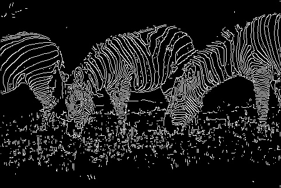
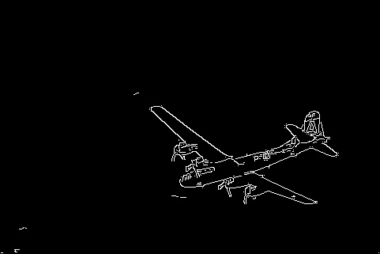
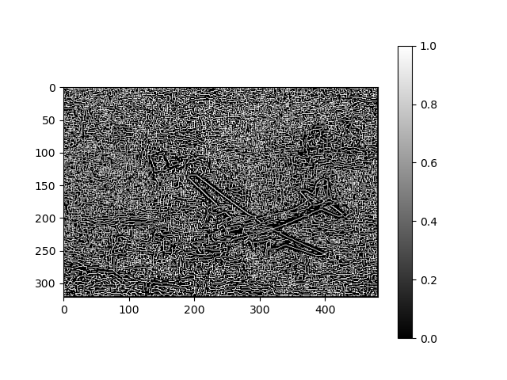
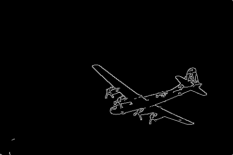

# Project 5 Canny
> 计算机85 张子诚
### 展示
**原图**


**Canny之后**





### Canny 算法的基本流程

* 计算经过高斯平滑后的梯度
* 将梯度方向离散化
* 梯度方向非极大值抑制
* 边缘连接

### 实现细节

**梯度计算**
`findDerivatives` 在实现的时候要注意
* `cv.filter2D` 的数据类型卡的很严格必须为`np.float32`
* 在计算方向梯度的时候需要加入`eps`防止除法溢出
```python
def findDerivatives(I_gray):
    
    # smoothing kernels
    gaussian = np.array([[2, 4, 5, 4, 2], [4, 9, 12, 9, 4], [5, 12, 15, 12, 5], [4, 9, 12, 9, 4], [2, 4, 5, 4, 2]],dtype=np.float32) 
    gaussian=gaussian/gaussian.sum()

    # kernel for x and y gradient
    # Sobel 卷积算子
    dx = np.float32([[-1.0, 0.0, 1.0], [-2.0, 0.0, 2.0], [-1.0, 0.0, 1.0]])
    dy = np.float32([[1.0, 2.0, 1.0], [0.0, 0.0, 0.0], [-1.0, -2.0, -1.0]])
    
    ###############################################################################
    # Your code here: calculate the gradient magnitude and orientation
    ###############################################################################
    
    # 利用高斯梯度对图像卷积
    dx_G=cv.filter2D(gaussian,-1,dx)
    dy_G=cv.filter2D(gaussian,-1,dy)
    # 计算Ix,Iy 注意filter计算要求float32
    Magx=cv.filter2D(np.float32(I_gray),-1,dx_G)
    Magy=cv.filter2D(np.float32(I_gray),-1,dy_G)
    
    # 计算梯度强度
    Mag=np.sqrt(Magx*Magx+Magy*Magy)
    
    np.clip(Mag,0,255)
    # 计算边缘梯度的方向
    eps=1e-8
    Ori_g=np.arctan(Magy/(Magx+eps))
    # 计算边缘方向
    Ori_e=np.arctan(-Magx/(Magy+eps))
    # 查看结果
    return Mag,Magx,Magy,Ori_g,Ori_e
```
梯度结果可视化

* x方向梯度图

.png)

* y方向梯度图

.png)

* 梯度强度图

  .png)

  .png)


**梯度以及边缘方向离散化**

`helper.py` 原文件存在的问题
* 直接将梯度方向传入`get_edge_angle()`
* `get_discrete_orientation()` 函数缺少边缘方向参数 

修改如下
```python
def get_gradient_angle(angleDeg):
    # 找一个最靠近的方向
    discrete = [0, 45, 90, 135, 180, -45, -90, -135, -180]
    dir = min(discrete, key=lambda x:abs(x-angleDeg))

    return dir


def get_edge_angle(a):
    discrete = [0, 45, 90, 135, 180, -45, -90, -135, -180]
    dir = min(discrete, key=lambda x:abs(x-a))

    return dir


def get_discrete_orientation(Ori_g,Ori_e):
    angle_Ori_g= np.degrees(Ori_g)
    angle_Ori_e= np.degrees(Ori_e)
    # 函数向量化
    get_gradient_angle_vect = np.vectorize(get_gradient_angle)
    # 离散化的梯度方向
    discrete_gradient_orientation = get_gradient_angle_vect(angle_Ori_g)

    get_edge_angle_vect = np.vectorize(get_edge_angle)
    # 离散化的边缘方向
    discrete_edge_orientation = get_edge_angle_vect(np.absolute(angle_Ori_e))
    

    return discrete_gradient_orientation, discrete_edge_orientation
```

**梯度方向非极大值抑制**

```python
def choose(Mag,grad_Ori,i,j):
    if grad_Ori[i,j] in [0,180,-180]:
        grad1=Mag[i,j+1]
        grad2=Mag[i,j-1]
    elif grad_Ori[i,j] in [45,-135]:
        grad1=Mag[i-1,j+1]
        grad2=Mag[i+1,j-1]
    elif grad_Ori[i,j] in [90,-90]:
        grad1=Mag[i-1,j] 
        grad2=Mag[i+1,j]
    elif grad_Ori[i,j] in [135,-45]:
        grad1=Mag[i-1,j-1]
        grad2=Mag[i+1,j+1] #
    return grad1,grad2


def nonMaxSup(Mag,grad_Ori):
    H,W=Mag.shape
    suppressed = np.copy(Mag)
    suppressed.fill(0)
    # 遍历像素点
    for i in range(1,H-1): 
        for j in range(1,W-1):
            # 如果梯度为0
            if Mag[i,j]==0:
                suppressed[i,j]=0
            else:
                grad1,grad2=choose(Mag,grad_Ori,i,j)
                if grad1<Mag[i,j] and grad2<Mag[i,j]:
                    suppressed[i,j]=1
                else:
                    suppressed[i,j]=0

    return suppressed
```
NMS 结果可视化



**边缘连接**

主要是原文件给的`edgelink.pyc` 可能是windows下生成的，导致里面的一些换行符在linux下报错。所以重写了`edgelink` 函数

```python
# high point edge Ori
def choose(x,y,edge_Ori):
    if edge_Ori[x,y] in [0,180,-180]:
        return (x,y-1,x,y+1)
    elif edge_Ori[x,y] in [45,-135]:
        return (x-1,y+1,x+1,y-1)
    elif edge_Ori[x,y] in [90,-90]:
        return (x-1,y,x+1,y)
    elif edge_Ori[x,y] in [135,-45]:
        return (x-1,y-1,x+1,y+1)

def edgeLink(M, Mag, edge_Ori):
    thresh_high=0.1*Mag.max()
    thresh_low=0.02*Mag.max()

    # 记录下梯度强度
    NMS=Mag*M 
    edge=np.copy(NMS)
    # 获取mask
    mask_high=edge>thresh_high
    mask_low=edge<thresh_low
    mask1,mask2=edge<=thresh_high,edge>=thresh_low
    # 一定包含
    edge[mask_high]=1
    # 不包含
    edge[mask_low]=0
    # maybe
    edge[mask1 & mask2]=-1

    # high index
    X,Y=np.where(mask_high)
    for i in range(len(X)):
        x1,y1,x2,y2=choose(X[i],Y[i],edge_Ori)
        if edge[x1,y1]==-1:
            mask_high[x1,y1]=True
        if edge[x2,y2]==-1:
            mask_high[x1,y1]=True
    
    edgeLinks=np.zeros(edge.shape)
    edgeLinks[mask_high]=255
    

    return edgeLinks
```

最后运行并和opencv中的canny比较

**my-canny**

.png)

**opencv-canny**



